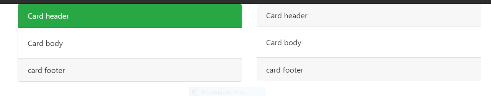

# Bootstrap
## What is bootstrap:
* Bootstrap is the popular HTML, CSS and JavaScript framework for developing a responsive web applications.
    * Bootstrap was developed by Mark Otto and Jacob Thornton at Twitter
    * It is absolutely free to download and use.
    * It is a front-end framework used for easier and faster web development.
    * By using Bootstrap we can build  Responsiveness web applications with the help of predefined classes
## Advantages of using bootstrap:

###  Lightweight and customizable:
 * If we talk about lightweight and customizability then bootstrap 4 is one of the best. Because this is one of the lightweight frameworks. you can install this very easily and also loading speed is very fast.

 * You can customize bootstrap 4 whatever you want. bootstrap fully supports customization.

### Saves lot of development time 
 * This will saves a lot of time. because it’s very easy to develop. Bootstrap provides all the classes ready mate. There is a very large class library in the bootstrap. We can say bootstrap works on only classes.

### Open Source:
   * Yes, This is right! Bootstrap is a totally open source. If you want to use bootstrap then you don’t have to pay. You just have to go on the bootstrap’s official website and download directory from there. Bootstrap also provides CDN for your use

### Compatible with browsers:
  * If you can use bootstrap 4 for your website, then you don’t worry about the compatibility of browsers. because if you are installing bootstrap 4 on your website this will compatible with all the browsers. like Google Chrome, Firefox, Safari, Opera Mini, and many more browsers.
    
### Great grid system:
  * In this framework grid system is amazing. we can say one of the very useful for a responsive web design system that is the grid system. here we can see 1 to 12 pairs of the grid system and we can use it as per our need.
    

## How to use bootstrap in the application:
  * We can use bootstrap to websites in 2 ways
   * 1.Offline(download directory)
   * 2.Online(using CDN)
              
## 1.Online CDN for Bootstrap:
  ### CSS:
  * Have to follow some steps to install this CDN in websites.
    ```
    step 1: Open your website's "index.html" page.
    step 2: you will see <head> tag in the nested of **<html>** tag.
    step 3: copy this CDN
    step 4: Paste this CSS CDN in the top of </head> tag
    ```
  ### Online Links:
  
    ```
    <!-- Latest compiled and minified CSS -->
    <link rel="stylesheet" href="https://maxcdn.bootstrapcdn.com/bootstrap/3.4.1/css/bootstrap.min.css">
    ```

  ### Javascript:
  * For pasting JavaScript in the body you have to follow bottom steps:
    ```
    Step 1: Scroll the bottom of your “index.html” file.
    Step 2: There you will see the body tag is closing. like </body>.
    Step 3: Copy the bottom scripts and past on the top of the </body> tag.
    ```
    ### Links:
    ```
    <!-- jQuery library -->
    <script src="https://ajax.googleapis.com/ajax/libs/jquery/3.5.1/jquery.min.js"></script>

    <!-- Latest compiled JavaScript -->
    <script src="https://maxcdn.bootstrapcdn.com/bootstrap/3.4.1/js/bootstrap.min.js"></script>
    ```
    
 ### Example of using bootstrap CDN(Content Delivery Network):
```
<!DOCTYPE html>
<html lang="en" dir="ltr">
  <head>
    <meta charset="utf-8">
    <title>bootstrap</title>
    <link rel="stylesheet" href="https://maxcdn.bootstrapcdn.com/bootstrap/3.4.1/css/bootstrap.min.css">
  </head>
  <body>
    <h1>Welcome to bootstrap</h1>
    <script src="https://ajax.googleapis.com/ajax/libs/jquery/3.5.1/jquery.min.js"></script>
    <script src="https://maxcdn.bootstrapcdn.com/bootstrap/3.4.1/js/bootstrap.min.js"></script>
  </body>
</html>
```
 
 ## 2.Download Bootstrap for offline:
 * First Download CDN's Directory and use by following steps
 
 Step 1:
     Go to Website [getbootstrap.com](https://getbootstrap.com/)
     
 Step 2:
      Select the version of bootstrap which you want to download.
      
 step 3:
      After selection of versions move on the right side of the header and click on the download button.
      
 step 4:
       Extract the bootstrap directory in local computer
       
 step 5:
       It Have many files in the folder from those you have to open the dist folder
       
 step 6:
       In the dist folder you will found two folders
                   ```
                   1.CSS
                    2.JS
                    ```
                    
step 7:
       In CSS Folder contains many files in that you have to select and copy bootstrap.min.css and paste that file in the project directory.
       
Step 8:
        Same like as CSS files there also js files in JS folder from there we will copy the bootstrap.min.js file and place this in project directory
        
Step 9: 
    Open the “Index.html” file.

Step 10: 
     <link rel=”stylesheet” href=”Here your file directory path”> copy this line and past in the top of </head> tag. This is for the “bootstrap.min.css” file.

Step 11: 
      We have pasted CSS file now Past Javascript in the top of </body> tag. for example <script src=”Here your file path”>. This is for the “bootstrap.min.js” file.
   
## Example:
```
<!DOCTYPE html>
<html lang="en" dir="ltr">
  <head>
    <meta charset="utf-8">
    <title>bootstrap</title>
    <link rel="stylesheet" href="/css/bootstrap.min.css">
  </head>
  <body>
    <h1>Welcome to bootstrap</h1>
    
    <script type="text/javascript" src="/js/bootstrap.min.js">
  </body>
</html>
```
      
       
Note*:
   * If you are using Bootstrap directory online then this will actually access data from the bootstrap own directory. this will take time from retrieving data from there.
   
   * And if you are using the Bootstrap 4.0 directory from the download. then this will access data from your own directory. So this will easy to access data for your website

## viewport:
 * Bootstrap is mobile friendly: Bootstrap is designed to be responsive to mobile devices
 * Mobile-first styles are part of the core framework of Bootstrap.You have to add the following <meta> tag inside the <head> element for proper rendering and touch zooming.
  
`<meta name="viewport" content="width=device-width, initial-scale=1">`

#### Note: 
 The "width=device-width" part is used to set the width of the page to follow the screen-width of the device (vary according to the devices).
 
 * The initial-scale=1 part is used to set the initial zoom level when the page is first loaded by the browser.
 
 ## container:
 * container is used to wrap the site contents
 * There are two container classes.
    * .container
    * .container-fluid
  * The .container class provides a responsive fixed width container
  
  ## Syntax:
  
  ```
  <div class="container">
        <!-- Content here -->
     </div>
 ```
     
 ## Example for Container:
 ```
 <!DOCTYPE html>
<html lang="en" dir="ltr">
  <head>
    <meta charset="utf-8">
    <title></title>
    <link rel="stylesheet" href="/css/bootstrap.min.css">
  </head>
  <body>
    <div class="container">
      <h1>Surya</h1>
      <h2>Narla</h2>


    </div>

  </body>
</html>
```
O/P:
```
Surya
Narla
```

## .Container fluid:
  * Use .container-fluid for a full width container, spanning the entire width of the viewport.
  
## Syntax:

```data
<div class="container-fluid">
       ---content---
</div>
```

## Example of container and container fluid:
```
<!DOCTYPE html>
<html lang="en" dir="ltr">
  <head>
    <meta charset="utf-8">
    <title></title>
    <link rel="stylesheet" href="/css/bootstrap.min.css">
  </head>
  <body>
<div style="border: 1px solid green;margin: 15px;">
    <div class="container">
       <div class="col-md-6">
        <h1>Bootstrap container</h1>
        <p>Normal Size</p>
        <p>
          <button type="button" class="btn btn-primary">container one</button>
          <button type="button" class="btn btn-danger">container two</button>
          <button type="button" class="btn btn-warning">container three</button>
        </p>
       </div>
    </div>
    <div class="container-fluid">
       <div class="col-md-6">
        <h1>Bootstrap fluid container</h1>
        <p>Normal Size</p>
        <p>
          <button type="button" class="btn btn-primary">container one</button>
          <button type="button" class="btn btn-danger">container demo</button>
          <button type="button" class="btn btn-warning">container demo</button>
       </p>
     </div>
  </div>
  </body>
</html>
```
## Output:


## Bootstrap Jumbotron:
  * A Bootstrap jumbotron specifies a big box for getting extra attention to some special content or information. It is displayed as a grey box with rounded corners. It can also enlarge the font sizes of the text inside it.
  * You can put any valid HTML or other Bootstrap elements/ classes inside a jumbotron.
  * The class .jumbotron within the <div> element is used to create a jumbotron.

## Jumbotron Inside Container:
  * The Inside container is used in jumbotron, if you want the jumbotron to not extend to the edge of the screen.
  * Put the jumbotron inside the <div class="container">.
  
```  
<!DOCTYPE html>  
<html lang="en">  
<head>  
  <title>Bootstrap Example</title>  
  <meta charset="utf-8">  
  <meta name="viewport" content="width=device-width, initial-scale=1">  
  <link rel="stylesheet" href="https://maxcdn.bootstrapcdn.com/bootstrap/3.3.6/css/bootstrap.min.css">  
</head>  
<body>  
  
<div class="container">  
  <div class="jumbotron">  
    <h1>This is Jumbotron inside container!</h1>        
    <p>Jumbotron specifies a big box for getting extra attention to some special content or information.</p>  
  </div>  
  <p>This is some text.</p>        
  <p>This is another text.</p>        
</div>  
  
  <script src="https://ajax.googleapis.com/ajax/libs/jquery/1.12.0/jquery.min.js"></script>  
  <script src="https://maxcdn.bootstrapcdn.com/bootstrap/3.3.6/js/bootstrap.min.js"></script>  
</body>  
</html>
```
### Output:


## Jumbotron Outside Container:
* It is used when you want the jumbotron to extend to the screen edges.
* Put the jumbotron outside the <div class="container">.
  
 ### Example:
```
<!DOCTYPE html>  
<html lang="en">  
<head>  
  <title>Bootstrap Example</title>  
  <meta charset="utf-8">  
  <meta name="viewport" content="width=device-width, initial-scale=1">  
  <link rel="stylesheet" href="https://maxcdn.bootstrapcdn.com/bootstrap/3.3.6/css/bootstrap.min.css">  
</head>  
<body>  
  
<div class="jumbotron">  
  <h1>This is Jumbotron outside container!</h1>        
  <p>Jumbotron specifies a big box for getting extra attention to some special content or information.</p>  
</div>  
  
<div class="container">  
  <p>This is some text.</p>        
  <p>This is another text.</p>        
</div>  
  
  <script src="https://ajax.googleapis.com/ajax/libs/jquery/1.12.0/jquery.min.js"></script>  
  <script src="https://maxcdn.bootstrapcdn.com/bootstrap/3.3.6/js/bootstrap.min.js"></script>  
</body>  
</html>
```
### Output:


## Full-width Jumbotron:
* To get a jumbotron without rounded borders, you have to add the .jumbotron-fluid class and a .container or .container-fluid inside it.

  
## Example:
```
<!DOCTYPE html>  
<html lang="en">  
<head>  
  <title>Bootstrap Example</title>  
  <meta charset="utf-8">  
  <meta name="viewport" content="width=device-width, initial-scale=1">  
  <link rel="stylesheet" href="https://maxcdn.bootstrapcdn.com/bootstrap/4.0.0-beta.2/css/bootstrap.min.css">  
  <script src="https://ajax.googleapis.com/ajax/libs/jquery/3.2.1/jquery.min.js"></script>  
  <script src="https://cdnjs.cloudflare.com/ajax/libs/popper.js/1.12.6/umd/popper.min.js"></script>  
  <script src="https://maxcdn.bootstrapcdn.com/bootstrap/4.0.0-beta.2/js/bootstrap.min.js"></script>  
</head>  
<body>  
  
<div class="jumbotron jumbotron-fluid">  
  <div class="container">  
    <h1>Full-width Jumbotron</h1>          
  <p>Jumbotron specifies a big box for getting extra attention to some special content or information.</p>  
</div>  
  
<div class="container">  
  <p>This is some text.</p>        
  <p>This is another text.</p>        
</div>  
  
</body>  
</html> 
```
### Output:


# Colors:
* Convey meaning through color with a handful of color utility classes. Includes support for styling links with hover states, too.

## Text-color:

```
<p class="text-primary">.text-primary</p>
<p class="text-secondary">.text-secondary</p>
<p class="text-success">.text-success</p>
<p class="text-danger">.text-danger</p>
<p class="text-warning">.text-warning</p>
<p class="text-info">.text-info</p>
<p class="text-light bg-dark">.text-light</p>
<p class="text-dark">.text-dark</p>
<p class="text-muted">.text-muted</p>
<p class="text-white bg-dark">.text-white</p>
```
### Output:


* Contextual text classes also work well on anchors with the provided hover and focus states. Note that the .text-white and .text-muted class has no link styling.

## Code:
```
<p><a href="#" class="text-primary">Primary link</a></p>
<p><a href="#" class="text-secondary">Secondary link</a></p>
<p><a href="#" class="text-success">Success link</a></p>
<p><a href="#" class="text-danger">Danger link</a></p>
<p><a href="#" class="text-warning">Warning link</a></p>
<p><a href="#" class="text-info">Info link</a></p>
<p><a href="#" class="text-light bg-dark">Light link</a></p>
<p><a href="#" class="text-dark">Dark link</a></p>
<p><a href="#" class="text-muted">Muted link</a></p>
<p><a href="#" class="text-white bg-dark">White link</a></p>
```
### Output:


## Background color:
* Similar to the contextual text color classes, easily set the background of an element to any contextual class. Anchor components will darken on hover, just like the text classes. Background utilities do not set color, so in some cases you’ll want to use .text-* utilities.

## Code:
```
<div class="p-3 mb-2 bg-primary text-white">.bg-primary</div>
<div class="p-3 mb-2 bg-secondary text-white">.bg-secondary</div>
<div class="p-3 mb-2 bg-success text-white">.bg-success</div>
<div class="p-3 mb-2 bg-danger text-white">.bg-danger</div>
<div class="p-3 mb-2 bg-warning text-dark">.bg-warning</div>
<div class="p-3 mb-2 bg-info text-white">.bg-info</div>
<div class="p-3 mb-2 bg-light text-dark">.bg-light</div>
<div class="p-3 mb-2 bg-dark text-white">.bg-dark</div>
<div class="p-3 mb-2 bg-white text-dark">.bg-white</div>
```
### Output:


## Background gradient:
* When $enable-gradients is set to true, you’ll be able to use .bg-gradient- utility classes. By default, $enable-gradients is disabled and the example below is intentionally broken. This is done for easier customization from the moment you start using Bootstrap

## Code:
```
<div class="p-3 mb-2 bg-gradient-primary text-white">.bg-gradient-primary</div>
<div class="p-3 mb-2 bg-gradient-secondary text-white">.bg-gradient-secondary</div>
<div class="p-3 mb-2 bg-gradient-success text-white">.bg-gradient-success</div>
<div class="p-3 mb-2 bg-gradient-danger text-white">.bg-gradient-danger</div>
<div class="p-3 mb-2 bg-gradient-warning text-dark">.bg-gradient-warning</div>
<div class="p-3 mb-2 bg-gradient-info text-white">.bg-gradient-info</div>
<div class="p-3 mb-2 bg-gradient-light text-dark">.bg-gradient-light</div>
<div class="p-3 mb-2 bg-gradient-dark text-white">.bg-gradient-dark</div>
```

### Output:


# Bootstrap Alerts:
 * Bootstrap Alerts are used to provide an easy way to create predefined alert messages. Alert adds a style to your messages to make it more appealing to the users.
 * Provide contextual feedback messages for typical user actions with the handful of available and flexible alert messages.

* Alerts are available for any length of text, as well as an optional dismiss button. For proper styling, use one of the eight required contextual classes (e.g., .alert-success).
 
 ## Example:
 ```
 <div class="alert alert-primary" role="alert">
  This is a primary alert—check it out!
</div>
<div class="alert alert-secondary" role="alert">
  This is a secondary alert—check it out!
</div>
<div class="alert alert-success" role="alert">
  This is a success alert—check it out!
</div>
<div class="alert alert-danger" role="alert">
  This is a danger alert—check it out!
</div>
<div class="alert alert-warning" role="alert">
  This is a warning alert—check it out!
</div>
<div class="alert alert-info" role="alert">
  This is a info alert—check it out!
</div>
<div class="alert alert-light" role="alert">
  This is a light alert—check it out!
</div>
<div class="alert alert-dark" role="alert">
  This is a dark alert—check it out!
</div>
```
### Output:


* Alerts are created with the .alert class, followed by one of the contextual classes.
## List of all contextual classes:
    * .alert-success
    * .alert-info
    * .alert-warning
    * .alert-danger
    * .alert-primary
    * .alert-secondary
    * .alert-light
    * .alert-dark
# Code
```
<!DOCTYPE html>  
<html lang="en">  
<head>  
  <title>Bootstrap Example</title>  
  <meta charset="utf-8">  
  <meta name="viewport" content="width=device-width, initial-scale=1">  
  <link rel="stylesheet" href="https://maxcdn.bootstrapcdn.com/bootstrap/4.0.0-beta.2/css/bootstrap.min.css">  
  <script src="https://ajax.googleapis.com/ajax/libs/jquery/3.2.1/jquery.min.js"></script>  
  <script src="https://cdnjs.cloudflare.com/ajax/libs/popper.js/1.12.6/umd/popper.min.js"></script>  
  <script src="https://maxcdn.bootstrapcdn.com/bootstrap/4.0.0-beta.2/js/bootstrap.min.js"></script>  
</head>  
<body>  
  
<div class="container">  
  <h2>Alerts</h2>  
  <div class="alert alert-success">  
    <strong>Success!</strong> Used to indicate successful or positive action.  
  </div>  
  <div class="alert alert-info">  
    <strong>Info!</strong> Used to indicate a neutral informative change or action.  
  </div>  
  <div class="alert alert-warning">  
    <strong>Warning!</strong> Used to indicate a warning that might need attention.  
  </div>  
  <div class="alert alert-danger">  
    <strong>Danger!</strong> Used to indicate a dangerous or potentially negative action.  
  </div>  
  <div class="alert alert-primary">  
    <strong>Primary!</strong> Used to indicate an important action.  
  </div>  
  <div class="alert alert-secondary">  
    <strong>Secondary!</strong> Used to indicate a slightly less important action.  
  </div>  
  <div class="alert alert-dark">  
    <strong>Dark!</strong> Dark grey alert.  
  </div>  
  <div class="alert alert-light">  
    <strong>Light!</strong> Light grey alert.  
  </div>  
</div>  
  
</body>  
</html>
```
### Output:


## Link color:
* Use the .alert-link utility class to quickly provide matching colored links within any alert.

# Code
```
<div class="alert alert-primary" role="alert">
  This is a primary alert with <a href="#" class="alert-link">an example link</a>. Give it a click if you like.
</div>
<div class="alert alert-secondary" role="alert">
  This is a secondary alert with <a href="#" class="alert-link">an example link</a>. Give it a click if you like.
</div>
<div class="alert alert-success" role="alert">
  This is a success alert with <a href="#" class="alert-link">an example link</a>. Give it a click if you like.
</div>
<div class="alert alert-danger" role="alert">
  This is a danger alert with <a href="#" class="alert-link">an example link</a>. Give it a click if you like.
</div>
<div class="alert alert-warning" role="alert">
  This is a warning alert with <a href="#" class="alert-link">an example link</a>. Give it a click if you like.
</div>
<div class="alert alert-info" role="alert">
  This is a info alert with <a href="#" class="alert-link">an example link</a>. Give it a click if you like.
</div>
<div class="alert alert-light" role="alert">
  This is a light alert with <a href="#" class="alert-link">an example link</a>. Give it a click if you like.
</div>
<div class="alert alert-dark" role="alert">
  This is a dark alert with <a href="#" class="alert-link">an example link</a>. Give it a click if you like.
</div>
```
### Output:


## Additional content:
* Alerts can also contain additional HTML elements like headings, paragraphs and dividers.

## code:
```
<div class="alert alert-success" role="alert">
  <h4 class="alert-heading">Well done!</h4>
  <p>Aww yeah, you successfully read this important alert message. This example text is going to run a bit longer so that you can see how spacing within an alert works with this kind of content.</p>
  <hr>
  <p class="mb-0">Whenever you need to, be sure to use margin utilities to keep things nice and tidy.</p>
</div>
```
### Output:


## Dismissing:
* Using the alert JavaScript plugin, it’s possible to dismiss any alert inline. Here’s how:
  * Be sure you’ve loaded the alert plugin, or the compiled Bootstrap JavaScript.
  * If you’re building our JavaScript from source, it requires util.js. The compiled version includes this.
  * Add a dismiss button and the .alert-dismissible class, which adds extra padding to the right of the alert and positions the .close button.
  * On the dismiss button, add the data-dismiss="alert" attribute, which triggers the JavaScript functionality. Be sure to use the <button> element with it for proper behavior across all devices.
  

## Code
```
<div class="alert alert-warning alert-dismissible fade show" role="alert">
  <strong>Holy guacamole!</strong> You should check in on some of those fields below.
  <button type="button" class="close" data-dismiss="alert" aria-label="Close">
    <span aria-hidden="true">&times;</span>
  </button>
</div>
```

### Output:
 

## Animated Alerts:
  * You can use .fade and .show classes to add a fading effect when closing the alert message.

## Example:
```
<!DOCTYPE html>  
<html lang="en">  
<head>  
  <title>Bootstrap Example</title>  
  <meta charset="utf-8">  
  <meta name="viewport" content="width=device-width, initial-scale=1">  
  <link rel="stylesheet" href="https://maxcdn.bootstrapcdn.com/bootstrap/4.0.0-beta.2/css/bootstrap.min.css">  
  <script src="https://ajax.googleapis.com/ajax/libs/jquery/3.2.1/jquery.min.js"></script>  
  <script src="https://cdnjs.cloudflare.com/ajax/libs/popper.js/1.12.6/umd/popper.min.js"></script>  
  <script src="https://maxcdn.bootstrapcdn.com/bootstrap/4.0.0-beta.2/js/bootstrap.min.js"></script>  
</head>  
<body>  
  
<div class="container">  
  <h2>Animated Alerts Example</h2>  
  <div class="alert alert-success alert-dismissable fade show">  
    <button type="button" class="close" data-dismiss="alert">×</button>  
    <strong>Success!</strong> This alert box could indicate a successful or positive action.  
  </div>  
  <div class="alert alert-info alert-dismissable fade show">  
    <button type="button" class="close" data-dismiss="alert">×</button>  
    <strong>Info!</strong> This alert box could indicate a neutral informative change or action.  
  </div>  
  <div class="alert alert-warning alert-dismissable fade show">  
    <button type="button" class="close" data-dismiss="alert">×</button>  
    <strong>Warning!</strong> This alert box could indicate a warning that might need attention.  
  </div>  
  <div class="alert alert-danger alert-dismissable fade show">  
    <button type="button" class="close" data-dismiss="alert">×</button>  
    <strong>Danger!</strong> This alert box could indicate a dangerous or potentially negative action.  
  </div>  
  <div class="alert alert-primary alert-dismissable fade show">  
    <button type="button" class="close" data-dismiss="alert">×</button>  
    <strong>Primary!</strong> Indicates an important action.  
  </div>  
  <div class="alert alert-secondary alert-dismissable fade show">  
    <button type="button" class="close" data-dismiss="alert">×</button>  
    <strong>Secondary!</strong> Indicates a slightly less important action.  
  </div>  
  <div class="alert alert-dark alert-dismissable fade show">  
    <button type="button" class="close" data-dismiss="alert">×</button>  
    <strong>Dark!</strong> Dark grey alert.  
  </div>  
  <div class="alert alert-light alert-dismissable fade show">  
    <button type="button" class="close" data-dismiss="alert">×</button>  
    <strong>Light!</strong> Light grey alert.  
  </div>  
</div>  
</body>  
</html>
```
### Output:


# documentation3

# Bootstrap 4 Grid System:
  Grid System nested of rows class. In the bootstrap grid system allows upto 12 columns across the page. we can use the grid as per our requirement but total of grids is must be 12.

## How Works the bootstrap Grid System:
   The grid system is the bundle of classes. There are 12 columns and a 1-row total bundle of 13 classes. There is no limitation for the use of columns. But you have to mind one thing, The thing is the total of your grids must be 12. This is the biggest reason for the system is flexible with all the screen sizes. This grid system supports a max value of 12 columns. Anything after the 12th column will be shifted to a new line.
   
   This will re-arrange as per the device’s screen size. You can use the grid in the .row class. Row class is must be required for grids. because this will help to arrange the columns of the grid. and the row class should be nested of .container class. You can use rows in the .container class.
   
Grid Classes:
There are four classes in Bootstrap Grid System:
  * xs(for phones)
  * sm(for tablets)
  * md(for desktops)
  * lg(for larger desktops)
  
Bootstrap 4 Grid Classes:
There are 5 classes in Bootstrap grid system.
* .col-(extra small devices)
* .col-sm- (small devices)
* .col-md- (medium devices)
* .col-lg- (large devices)
* .col-xl- (xlarge devices)

 
   
   
## Size of grids in different screens:
____
**Screen Size** | **Columns work**
---|---
Less then 575px | col-*
Between 575px to 768px | col-sm-*
Between 768px to 992px | col-md-*
Between 992px to 1200px | col-lg-*
More then 1200px | col-xl-*

## Container:
* .container, which sets a max-width at each responsive breakpoint
* .container-fluid, which is width: 100% at all breakpoints

## Grid:


## Example
col-sm-*:

code:

```<!DOCTYPE html>
<html lang="en" dir="ltr">
  <head>
    <meta charset="utf-8">
    <meta name="viewport" content="width=device-width,initial-scale=1.0">
    <link rel="stylesheet" href="/css/bootstrap.min.css">
    <title></title>
    <style>
      .row_data{
        border: 2px dashed red;
        padding: 1%;
      }
      .col_data{
        border: 2px dotted blue;
        margin: 1%;
      }
    </style>
  </head>
  <body>
    <div class="container">
  <div class="row bg-light row_data">
    <div class="col-sm col_data">
      venkata
    </div>
    <div class="col-sm col_data">
      surya
    </div>
    <div class="col-sm col_data">
      narayana
    </div>
  </div>
</div>
  </body>
</html>
```
* All columns having equal with

 
 
 * Changing columns width:
 
  

 * The above example creates three equal-width columns on small, medium,      large, and extra large devices using our predefined grid classes. Those    columns are centered in the page with the parent .container.
 
## Equal-width multi-line
* Create equal-width columns that span multiple lines by inserting a .w-100 where you want the columns to break to a new line. Make the breaks responsive by mixing .w-100 with some responsive display utilities.

```<div class="container">
  <div class="row">
    <div class="col">col</div>
    <div class="col">col</div>
    <div class="w-100"></div>
    <div class="col">col</div>
    <div class="col">col</div>
  </div>
</div>
```

 

## Responsive classes
* Bootstrap’s grid includes five tiers of predefined classes for building complex responsive layouts. Customize the size of your columns on extra small, small, medium, large, or extra large devices however you see fit.

## All breakpoints
 * For grids that are the same from the smallest of devices to the largest, use the .col and .col-* classes. Specify a numbered class when you need a particularly sized column; otherwise, feel free to stick to .col.
 
 ```<div class="container">
  <div class="row">
    <div class="col">col</div>
    <div class="col">col</div>
    <div class="col">col</div>
    <div class="col">col</div>
  </div>
  <div class="row">
    <div class="col-8">col-8</div>
    <div class="col-4">col-4</div>
  </div>
</div>
```

 

## Stacked to horizontal:
* Using a single set of .col-sm-* classes, you can create a basic grid system that starts out stacked and becomes horizontal at the small breakpoint (sm).

```<div class="container">
  <div class="row">
    <div class="col-sm-8">col-sm-8</div>
    <div class="col-sm-4">col-sm-4</div>
  </div>
  <div class="row">
    <div class="col-sm">col-sm</div>
    <div class="col-sm">col-sm</div>
    <div class="col-sm">col-sm</div>
  </div>
</div>
```

 


```<div class="row" style="justify-content:center">
      <div class="col-md-4 col-sm-8 col-lg-4">
        <div class="card">
          <div class="card-header bg-success text-light"> Card header</div>
           <div class="card-body"> Card body</div>
          <div class="card-footer">card footer</div>
        </div>
     </div>
     <div class="col-md-4 col-sm-8 col-lg-4">
        <div class="card-header"> Card header</div>
        <div class="card-body"> Card body</div>
        <div class="card-footer">card footer</div>
     </div>
</div>
```
    
  In col-lg:
  
  
  * LargeEnd devices

  
  In col-md:
   
   
   
   col-sm:
    
  


 


  
  


    
 
